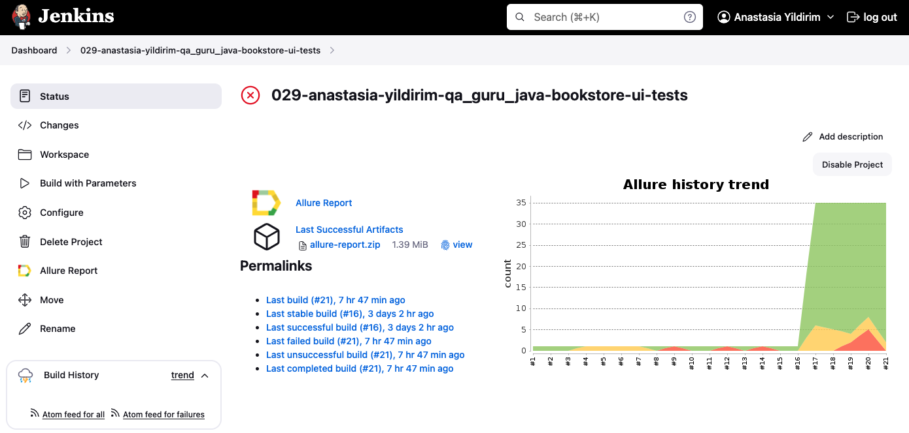
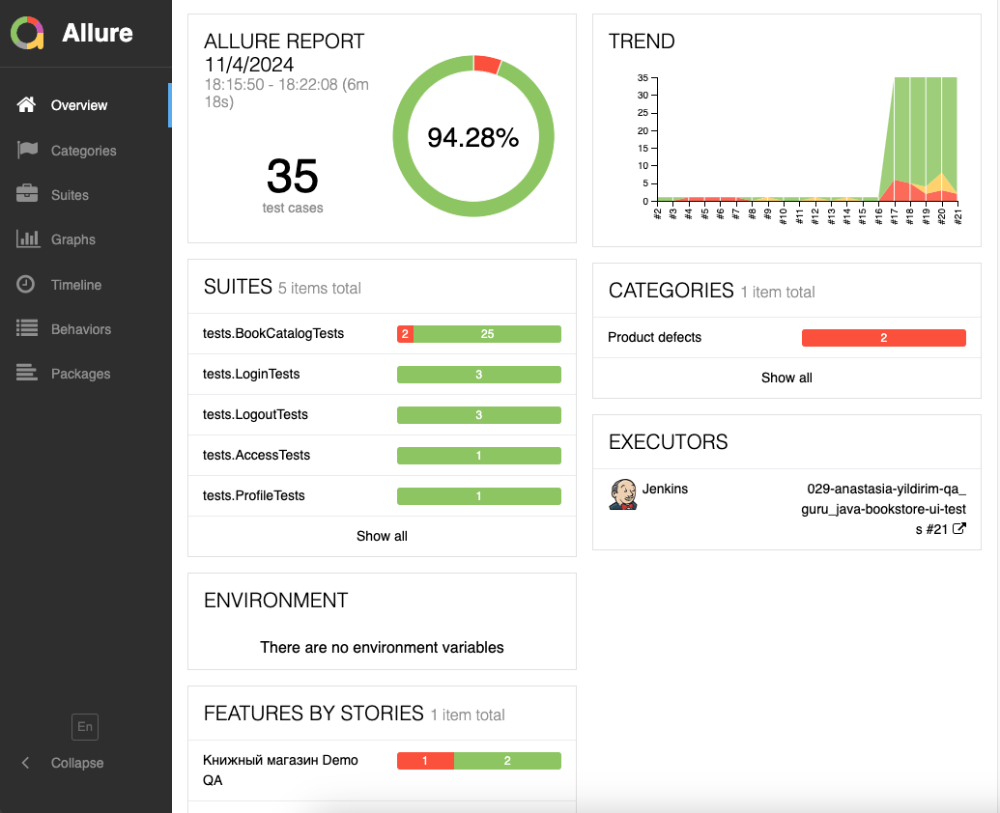
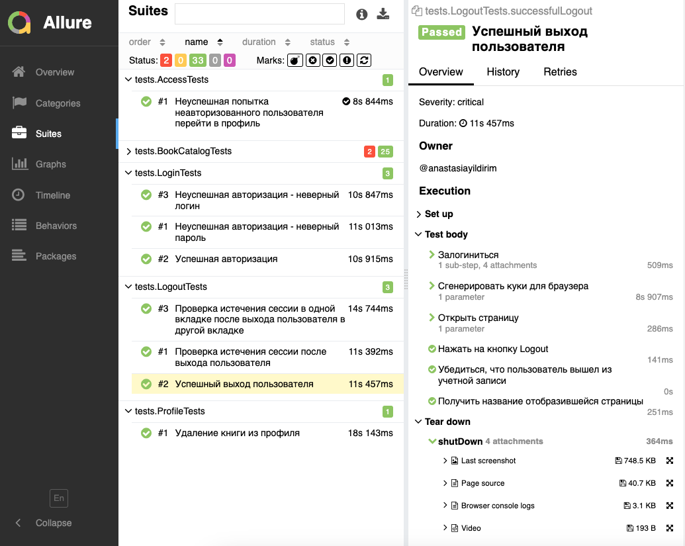
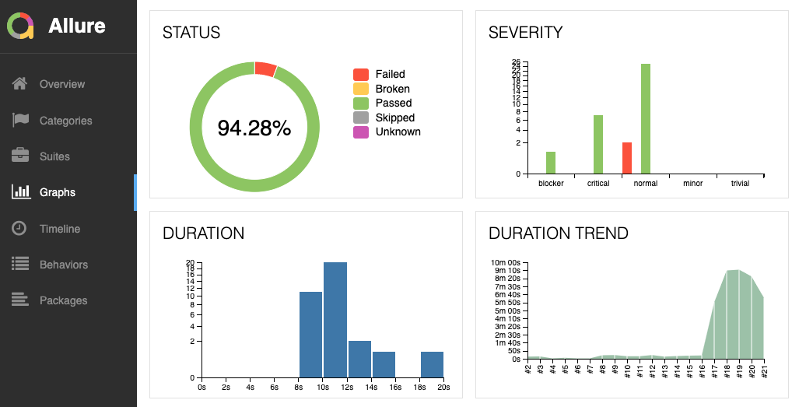
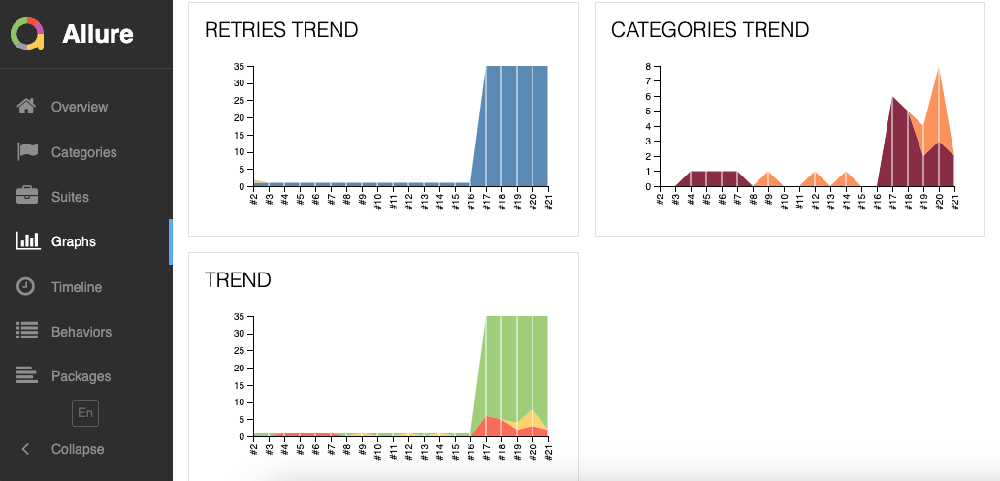
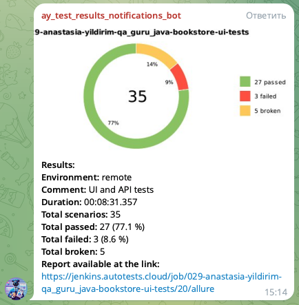
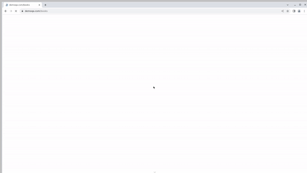

# Проект по автоматизации тестирования для книжного магазина [DEMOQA Books](https://demoqa.com/books)

> DEMOQA Books — ведущая розничная компания, специализирующаяся на продаже книг по информационным технологиям, программированию и смежным дисциплинам.

## **Содержание:**
____

* <a href="#tools">Технологии и инструменты</a>

* <a href="#cases">Примеры автоматизированных тест-кейсов</a>

* <a href="#jenkins">Сборка в Jenkins</a>

* <a href="#console">Запуск из терминала</a>

* <a href="#allure">Allure отчет</a>

* <a href="#telegram">Уведомление в Telegram при помощи бота</a>

* <a href="#video">Примеры видео выполнения тестов на Selenoid</a>
____
<a id="tools"></a>
## <a name="Технологии и инструменты">**Технологии и инструменты:**</a>

<p align="center">  
<a href="https://www.java.com/"></a>  
<a href="https://junit.org/junit5/"></a>  
<a href="https://gradle.org/"></a>  
<a href="https://selenide.org/"></a>  
<a href="https://aerokube.com/selenoid/"></a>  
<a href="ht[images](images)tps://github.com/allure-framework/allure2"></a>    
<a href="https://www.jenkins.io/"></a>  
</p>

____
<a id="cases"></a>
## <a name="Примеры автоматизированных тест-кейсов">**Примеры автоматизированных тест-кейсов:**</a>
____
- ✓ *Успешная и неуспешная авторизация*
- ✓ *Добавление книги в профиль и удаление книги из профиля*
- ✓ *Поиск книг в каталоге*
- ✓ *Сортировка книг в каталоге*
- ✓ *Настройки отображения книг в каталоге*
- ✓ *Выход из учетной записи и завершение сеанса пользователя*

____
<a id="jenkins"></a>
## </a><a name="Сборка"></a>Сборка в [Jenkins](https://jenkins.autotests.cloud/job/029-anastasia-yildirim-qa_guru_java-bookstore-ui-tests/)</a>
____
<p align="center">  
<a href="https://jenkins.autotests.cloud/job/029-anastasia-yildirim-qa_guru_java-bookstore-ui-tests/"></a>  
</p>


### **Параметры сборки в Jenkins:**

- *baseUrl (адрес тестируемого веб-сайта)*
- *login (логин тестового пользователя)*
- *password (пароль тестового пользователя)*
  
- *browser (браузер, по умолчанию chrome)*
- *browserVersion (версия браузера, по умолчанию 122.0)*
- *browserSize (размер окна браузера, по умолчанию 1920x1080)*

- *isRemote (настройка для удаленного запуска)*
- *selenoidUser, DselenoidPassword и selenoidHost (логин, пароль и хост удаленного сервера Selenoid)*

<a id="console"></a>
## Команды для запуска из терминала
___
***Локальный запуск:***

```bash  
gradle clean test -Dlogin=ЛОГИН -Dpassword=ПАРОЛЬ
```
Чтобы получить ЛОГИН и ПАРОЛЬ, создайте тестового пользователя на https://demoqa.com/register


***Удалённый запуск через Jenkins:***
```bash  
clean test
"-DbaseUrl=${baseUrl}"
"-Dlogin=${login}"
"-Dpassword=${password}"
"-Dbrowser=${browser}"
"-DbrowserVersion=${browserVersion}"
"-DbrowserSize=${browserSize}"
"-DisRemote=true"
"-DselenoidUser="
"-DselenoidPassword="
"-DselenoidHost="
```
___
<a id="allure"></a>
## </a> <a name="Allure"></a>Allure [отчет](https://jenkins.autotests.cloud/job/029-anastasia-yildirim-qa_guru_java-bookstore-ui-tests/allure/)</a>
___

### *Основная страница отчёта*

<p align="center">  
  
</p>  

### *Тест-кейсы*

<p align="center">  
  
</p>

### *Графики*

  <p align="center">  


  
</p>

____
<a id="telegram"></a>
## </a> Уведомление в Telegram при помощи бота
____
<p align="center">  
  
</p>

____
<a id="video"></a>
## </a> Примеры видео выполнения тестов на Selenoid
____
<p align="center">
   
</p>
